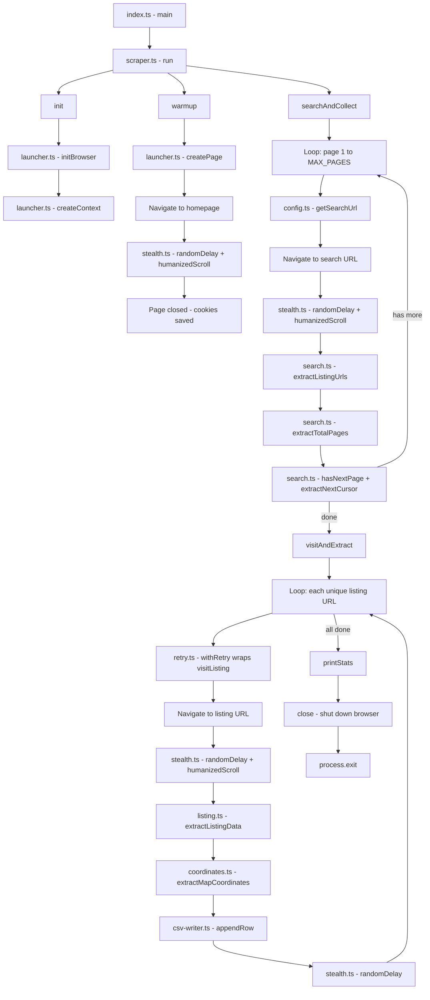

# Airbnb Scraper

Scraper de listings do Airbnb para **"Espaço Inteiro"** no **Centro de Curitiba**, usando Playwright com técnicas anti-detecção.

## Setup

```bash
npm install
cp .env.example .env   # editar conforme necessário
npm run build
npm start
```

## Scripts

| Script | Comando | Descrição |
|--------|---------|-----------|
| `build` | `tsc` | Compila TypeScript para `dist/` |
| `start` | `node dist/index.js` | Executa o scraper |
| `dev` | `tsc && node dist/index.js` | Build + execução |
| `clean` | `rm -rf dist` | Remove build |

## Variáveis de Ambiente

| Variável | Default | Descrição |
|----------|---------|-----------|
| `PROXY_URL` | — | URL do proxy (opcional) |
| `MAX_PAGES` | 5 | Máximo de páginas de busca |
| `DELAY_MIN` | 4000 | Delay mínimo entre páginas (ms) |
| `DELAY_MAX` | 8000 | Delay máximo entre páginas (ms) |
| `LISTING_DELAY_MIN` | 3000 | Delay mínimo entre listings (ms) |
| `LISTING_DELAY_MAX` | 6000 | Delay máximo entre listings (ms) |
| `MAX_RETRIES` | 3 | Tentativas de retry por listing |
| `OUTPUT_FILE` | `data/listings.csv` | Arquivo de saída |

## Estrutura do Projeto

```
src/
  index.ts                    # Entry point
  scraper.ts                  # Orquestrador principal
  config.ts                   # Configurações + URL builder
  types.ts                    # Interfaces compartilhadas

  browser/
    index.ts                  # Barrel re-exports
    launcher.ts               # Init do browser, context, page
    stealth.ts                # Anti-detecção: delays, scroll

  extraction/
    index.ts                  # Barrel re-exports
    coordinates.ts            # Extração de lat/lng do mapa
    listing.ts                # Extração de dados de um listing
    search.ts                 # Parsing da página de busca + paginação

  output/
    csv-writer.ts             # Escrita incremental em CSV

  utils/
    retry.ts                  # Retry genérico com backoff exponencial
```

## Fluxo de Execução



## Output

O scraper gera `data/listings.csv` com as colunas:

```
listing_id, url, titulo, localizacao, coordenadas, coletado_em
```

## Técnicas Anti-Detecção

- Browser stealth flags (`--disable-blink-features=AutomationControlled`)
- Warm-up session (homepage antes de buscar)
- Delays aleatórios entre páginas e listings
- Scroll humanizado (5 passos com delays)
- User-Agent realista (5 opções)
- Viewport aleatório (5 resoluções)
- Retry com backoff exponencial (30-60s)
- Persistent context (cookies entre páginas)
- Suporte a proxy (configurável)
